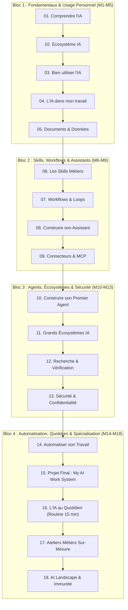

# 🧠 ACADÉMIE OPAYS — Système d'Acculturation & d'Autonomisation à l'IA pour Professionnels
> **Document Maître de Référence (AGENT.md) — Version 3.0**  
> *Architecture pédagogique complète, modèle mental des agents, curriculum des 18 modules et standards d'autonomisation pour professionnels en RDC et Afrique Francophone.*

---

## 1. 🎯 Identité, Vision & Règle d'Or

### 1.1. Positionnement
L'**Académie OPAYS** forme des professionnels en activité (cadres de la fonction publique, dirigeants de PME, responsables RH, chefs de projets, directeurs financiers) pour les rendre autonomes, critiques et outillés avec l'IA dans leur travail quotidien.
* **Ce que nous ne sommes pas** : Une formation théorique d'ingénieurs IA ou un catalogue éphémère de logiciels.
* **Ce que nous sommes** : Un système d'acculturation et d'autonomisation pratique pour réorganiser son travail, éliminer les tâches répétitives, maîtriser les agents et acquérir une immunité technologique durable.

### 1.2. La Règle d'Or Pédagogique
> **« Est-ce que cela va aider cette personne à mieux travailler avec l'IA dès aujourd'hui ? »**  
> Si la réponse est non $\rightarrow$ on ne l'ajoute pas.  
> **« Never teach the tool before teaching the problem. »**

---

## 2. 🧩 Le Modèle Mental Universel de l'Agent IA

Pour enseigner les technologies modernes (Assistants, Mémoire, Connecteurs, MCP, Skills, Loops) sans noyer les apprenants dans le code, nous utilisons **une seule représentation visuelle unifiée** :

```
┌────────────────────────────────────────────────────────────────────────┐
│                        ANATOMIE D'UN AGENT IA                          │
├────────────────────────────────────────────────────────────────────────┤
│  1. INSTRUCTIONS (Agent.md) : Qui est-il ? Quelles sont ses règles ?   │
│  2. SKILLS                  : Que sait-il faire de façon répétable ?   │
│  3. MÉMOIRE                 : Que doit-il retenir sur mon service ?    │
│  4. CONNECTEURS             : À quels services a-t-il accès (Drive...) │
│  5. MCP (Model Context)     : Le standard universel pour lier outils   │
│  6. WORKFLOW & LOOPS        : Comment enchaîne-t-il les étapes ?       │
│  7. CONTRÔLE HUMAIN         : Où l'humain valide-t-il impérativement ? │
└────────────────────────────────────────────────────────────────────────┘
```

---

## 3. 📚 Le Curriculum Master (Parcours en 18 Modules)



| N° | Module | Objectif Pédagogique Clé | Livrable Apprenant |
| :---: | :--- | :--- | :--- |
| **01** | **Comprendre l'IA** | Démystifier l'IA, LLM, hallucinations, 4 règles de départ. | Grille de 5 tests réussie. |
| **02** | **Découvrir l'écosystème** | Les 5 familles d'outils, grille de sélection d'outils. | Fiche d'évaluation d'un outil. |
| **03** | **Bien utiliser l'IA** | Formule de prompt C.O.R.E. et itération professionnelle. | Boîte de 5 prompts C.O.R.E. |
| **04** | **L'IA dans mon travail** | *« Mon travail sous microscope »*, matrice des tâches et ROI. | 3 cas d'usage ROI identifiés. |
| **05** | **Documents & Données** | Les 6 opérations documentaires (PDF, Excel) et NotebookLM. | Synthèse & tableau comparatif de PDF. |
| **06** | **Les Skills Métiers** | Transformer une tâche en capacité réutilisable. | 3 Skills métiers documentés. |
| **07** | **Workflows & Loops** | Décomposer en étapes. Boucle d'auto-critique et validation. | 1 Workflow multi-étapes testé. |
| **08** | **Construire son Assistant** | `Agent.md`, rôle, contexte permanent et mémoire. | 1 Assistant personnalisé en service. |
| **09** | **Connecteurs, Outils & MCP** | Tools (actions), Connecteurs (ponts) et MCP (standard USB-C). | Agent Tool Map & Permissions. |
| **10** | **Construire son Agent** | Assemblage en 12 étapes. Banc d'essai sur 5 cas critiques. | Agent V2 fonctionnel après tests. |
| **11** | **Grands Écosystèmes IA** | OpenAI, Anthropic, Google, Chine, Open Source. Règle anti-hype. | Grille comparative tri-écosystèmes. |
| **12** | **Recherche & Vérification** | Pyramide des sources, faits vs opinions, Source Checker. | Synthèse sourcée d'aide à la décision. |
| **13** | **Sécurité & Confidentialité** | 4 niveaux de données, anonymisation, prompt injection, Stop & Ask. | AI Safety Card signée. |
| **14** | **Automatiser son Travail** | 3 niveaux d'automatisation, Automation Canvas, calcul du ROI. | Automatisation V1 avec gain d'heures. |
| **15** | **Projet Final : AI System** | Soutenance en 10 min, certification par preuve de compétence. | Certification Pratique & AI Work Kit. |
| **16** | **L'IA au Quotidien** | Routine des 15 min, règle des 3 questions, test des 30 min. | AI Operating Plan & Suivi J+7/J+21/J+30. |
| **17** | **Spécialisation Métier** | Ateliers sur-mesure (Fonction publique, PME, RH, Com, Finance, Projets). | Livrable officiel de Cas d'Usage Métier. |
| **18** | **AI Landscape 2026** | Modèles ouverts vs propriétaires, super-pouvoirs spécialisés. | Fiche de stratégie technologique durable. |

---

## 4. ⏱️ Format d'une Session Live (90 à 120 min)

```
┌─────────────────────────────────────────────────────────────┐
│ 10-15 min │ EXPLICATION  : Le concept clé sans jargon       │
├─────────────────────────────────────────────────────────────┤
│ 20-25 min │ DÉMONSTRATION: Le formateur montre le cas réel  │
├─────────────────────────────────────────────────────────────┤
│ 30-40 min │ PRATIQUE     : Manipulation guidée ensemble     │
├─────────────────────────────────────────────────────────────┤
│ 20-25 min │ APPLICATION  : Application directe à son poste  │
├─────────────────────────────────────────────────────────────┤
│ 10 min    │ QUESTIONS    : Déblocage & Défi de la semaine   │
└─────────────────────────────────────────────────────────────┘
```

---

## 5. 📁 Les 4 Ressources Officielles par Module

Dans chaque dossier de module :
1. **`00_GUIDE_ANIMATION_SEANCE_XX.md`** : Le conducteur détaillé pour le formateur.
2. **`01_FICHE_SYNTHESE_XX.md`** : 1 page de synthèse pour l'apprenant.
3. **`02_FICHE_PRATIQUE_XX.md`** : Fiche d'outils, prompts ou checklists.
4. **`03_FICHE_EXERCICES_ET_DEVOIR.md`** : Exercices en séance et devoir hebdomadaire.

---

## 6. 🔄 Suivi Post-Formation : Les Sessions "AI Update"

Chaque mois, une session collective de **60 minutes** en ligne pour tous les diplômés :
* **Qu'est-ce qui vient de sortir ?** (Nouveaux modèles, MCP, nouveaux agents).
* **Pourquoi ça compte (ou pas) ?** (Filtre anti-hype).
* **Comment cela s'applique à votre travail ?**
