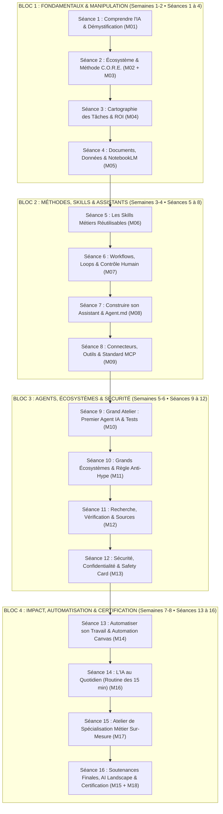

# 🏛️ Architecture & Parcours Pédagogique Définitif — Académie OPAYS
> **Document d'Ingénierie Pédagogique • Version 1.0**  
> *Articulation des 18 modules en 16 séances directes, jalons de compétences, devoirs, ressources et accompagnement pour cohortes professionnelles de 10 à 15 apprenants.*

---

## 1. 🎯 Structure Globale du Parcours

```
┌─────────────────────────────────────────────────────────────────────────────────┐
│                          CADRE OPÉRATIONNEL DU PROGRAMME                        │
├─────────────────────────────────────────────────────────────────────────────────┤
│ • Format de la cohorte     : 10 à 15 professionnels maximum (Google Meet)       │
│ • Durée totale             : 8 semaines intensives                              │
│ • Rythme hebdomadaire      : 2 séances de 1h30 à 2h par semaine (Mardi / Jeudi) │
│ • Charge globale           : 16 séances live (30h) + 8 permanences déblocage   │
│                              + 1 coaching individuel (30 min) + Travail métier │
│ • Plateforme d'apprentissage: Google Meet (Directs) + Google Classroom (Ressources)│
│ • Modalité de validation   : Soutenance pratique finale sur vrai dossier (ROI) │
└─────────────────────────────────────────────────────────────────────────────────┘
```

---

## 2. 🗺️ La Progression en 4 Blocs Pédagogiques



---

## 3. 📋 Matrice Maîtresse des 16 Séances de Formation

| Sem. | Séance & Module | Objectif Pédagogique Opérationnel | Exercice Live en Séance | Devoir Inter-Séances | Ressources Fournies |
| :---: | :--- | :--- | :--- | :--- | :--- |
| **S1** | **Séance 01** *(M01)* | Comprendre l'IA, démystifier les LLM et les hallucinations. | Grille des 5 tests comparatifs. | Tester 3 tâches sur 2 modèles différents. | `00_Guide`, `01_Fiche_Fondamentaux`, `02_Exercices`, `03_Exemples`. |
| **S1** | **Séance 02** *(M02+03)* | Choisir le bon outil & maîtriser la formule C.O.R.E. | Reformulation live de 3 demandes vagues. | Créer sa boîte de 5 prompts C.O.R.E. métiers. | `01_Fiche_Ecosysteme`, `01_Fiche_CORE`, `02_10_Techniques`. |
| **S2** | **Séance 03** *(M04)* | Cartographier son travail et identifier ses 3 cas d'usage ROI. | Fiche *Mon travail sous microscope*. | Tableau d'audit des 10 tâches hebdomadaires. | `01_Fiche_Identifier_Taches`, `02_Microscope`, `03_Workflow`. |
| **S2** | **Séance 04** *(M05)* | Traiter des PDF, rapports et tableaux sans hallucination. | Extraction et comparaison sur un rapport réel. | Produire 1 synthèse exécutive sourcée. | `01_Fiche_6_Operations_Docs`, `02_Verification_Securite`. |
| **S3** | **Séance 05** *(M06)* | Transformer une tâche répétitive en Skill documenté. | Remplir le Skill Canvas en 6 piliers. | Documenter et tester 2 Skills métiers réels. | `01_Fiche_Skill_Canvas`, `02_Tester_Ameliorer_Skill`. |
| **S3** | **Séance 06** *(M07)* | Décomposer une mission en étapes et boucles d'auto-critique. | Modéliser un workflow avec point d'arrêt humain. | Schématiser 1 workflow métier complet. | `01_Fiche_Workflow_Loop`, `02_Human_in_the_Loop`. |
| **S4** | **Séance 07** *(M08)* | Créer son Assistant personnalisé avec fichier `Agent.md`. | Rédiger son premier `Agent.md` opérationnel. | Configurer et tester son Assistant (Custom GPT/Gem). | `01_Fiche_Assistant_Canvas`, `02_Template_Agent_MD`. |
| **S4** | **Séance 08** *(M09)* | Comprendre les Outils, Connecteurs et le standard MCP. | Remplir l'Agent Tool Map et la chaîne d'accès. | Définir la politique de permissions de son agent. | `01_Fiche_Tools_Connecteurs_MCP`, `02_Permissions_Securite`. |
| **S5** | **Séance 09** *(M10)* | **Grand Atelier d'Assemblage** : Bâtir son 1er Agent IA. | Assembler l'agent et passer le banc des 5 tests. | Livrer son Agent IA en Version 2 (V2). | `01_Fiche_Agent_Canvas_Complet`, `02_Banc_Essai_5_Tests`. |
| **S5** | **Séance 10** *(M11)* | Comparer les écosystèmes (OpenAI, Claude, Google, Chine). | Résoudre les 5 arbitrages métiers sans fanatisme. | Tester la même tâche sur 3 écosystèmes. | `01_Fiche_Evaluer_Ecosysteme`, `02_Carte_Personnelle`. |
| **S6** | **Séance 11** *(M12)* | Rechercher avec l'IA, citer les sources et traquer les biais. | Atelier de détection des 5 pièges d'une réponse. | Réaliser une recherche sourcée avec Source Checker. | `01_Fiche_Recherche_Sources`, `02_Prompts_Verification`. |
| **S6** | **Séance 12** *(M13)* | Protéger les données, anonymiser et parer le Prompt Injection. | Le Jeu des 10 cas de sécurité et règle Stop & Ask. | Rédiger et signer son AI Safety Card personnelle. | `01_Fiche_AI_Safety_Card`, `02_Prompt_Injection`. |
| **S7** | **Séance 13** *(M14)* | Automatiser son travail avec l'Automation Canvas. | Décomposer 1 tâche en flux semi-automatisé. | Déployer son Automatisation V1 et calculer le ROI. | `01_Fiche_Automation_Canvas`, `02_Exemples_Metiers`. |
| **S7** | **Séance 14** *(M16)* | Ancrer l'IA au quotidien (Routine 15 min & Test 30 min). | Établir son AI Operating Plan personnel. | Compléter son AI Log de la semaine. | `01_Fiche_AI_Operating_Plan`, `02_Journal_AI_Log`. |
| **S8** | **Séance 15** *(M17)* | **Atelier de Spécialisation Métier** (Coaching individuel). | Traitement en direct d'un dossier réel de son poste. | Finaliser la fiche officielle de son Cas d'Usage Métier. | `01_Fiche_Mon_Cas_Usage`, `02_6_Parcours_Sectoriels`. |
| **S8** | **Séance 16** *(M15+18)*| **Soutenances Finales, Certification & AI Landscape**. | Soutenance de 10 min, démo live et remise des titres. | Feuille de route à 30 jours et intégration Alumni. | `01_Fiche_AI_Work_System`, `02_Grille_Evaluation`, `Landscape`. |

---

## 4. 🧭 Le Dispositif d'Accompagnement Triangulaire

```
┌─────────────────────────────────────────────────────────────────────────────────┐
│ 1. NIVEAU GROUPE (Les Séances Live Google Meet)                                 │
│    ➔ 2 fois par semaine (Mardi & Jeudi, 18h30-20h30) : Démo + Pratique + Retours. │
├─────────────────────────────────────────────────────────────────────────────────┤
│ 2. NIVEAU PERMANENCE (L'Office Hours Hebdomadaire)                              │
│    ➔ Chaque Samedi matin (10h00-11h00 sur Meet) : Session ouverte sans cours,  │
│       dédiée au déblocage technique, à l'aide sur les devoirs et aux questions. │
├─────────────────────────────────────────────────────────────────────────────────┤
│ 3. NIVEAU INDIVIDUEL (Le Coaching 1-on-1 Dédié)                                │
│    ➔ 1 créneau individuel de 30 minutes avec le formateur (Semaine 4 ou 7)     │
│       pour auditer sur-mesure le fichier Agent.md et le flux métier de l'apprenant.│
└─────────────────────────────────────────────────────────────────────────────────┘
```
