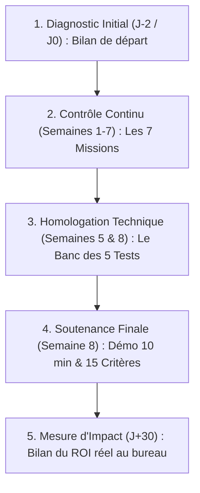

# 🏆 Système d'Évaluation & Certification par Preuve de Compétence — Académie OPAYS
> **Document Maître d'Ingénierie de la Certification • Version 1.0**  
> *Le cadre officiel d'évaluation formative, homologation des solutions, grille de soutenance finale, délivrance du Certificat Pratique et mesure du ROI à J+30.*

---

## 1. 🎯 Philosophie : L'Évaluation par la Preuve Réelle

L'Académie OPAYS rompt définitivement avec les modèles d'examens académiques traditionnels :
> **« Nous n'évaluons ni la mémoire, ni la capacité à réciter du vocabulaire technique, ni des QCM théoriques. Nous évaluons une seule chose : la capacité démontrée en direct à résoudre un vrai problème professionnel, fiabiliser son travail et gagner du temps avec l'IA en toute sécurité. »**

### Les 4 Piliers de l'Évaluation OPAYS :
1. **Preuve par l'Exécution (Démo Live)** : L'apprenant partage son écran et fait fonctionner sa solution sous les yeux du jury.
2. **Impact Métier Mesurable (ROI)** : Chaque compétence validée doit correspondre à une tâche réelle et à un gain de temps chiffré.
3. **Sécurité & Gouvernance Intégrées** : Aucune certification n'est accordée si les réflexes d'anonymisation et de contrôle humain souverain ne sont pas maîtrisés.
4. **Évaluation Formative & Continue** : Les erreurs commises pendant le parcours ne sont pas pénalisées ; elles constituent la matière première de l'apprentissage.

---

## 2. 🪜 Le Parcours d'Évaluation en 5 Étapes



---

## 3. 📋 ÉTAPE 1 : Le Formulaire de Diagnostic Initial (J-2)

Ce formulaire (Google Forms de 5 minutes) est complété avant la première séance pour étalonner la ligne de départ :

```markdown
### 📝 Formulaire de Diagnostic Initial — Académie OPAYS

1. IDENTITÉ & POSTE :
   - Nom & Prénom : _________________________________________________________
   - Fonction exacte : ______________________________________________________
   - Organisation / Entreprise / Ministère : ________________________________

2. CARTOGRAPHIE INITIALE DU TEMPS :
   - Quelles sont les 2 tâches qui vous prennent le plus de temps chaque semaine ? :
     * Tâche 1 : __________________________ (Temps estimé : _____ h/semaine)
     * Tâche 2 : __________________________ (Temps estimé : _____ h/semaine)
   - Quelle tâche répétitive trouvez-vous la plus pénible ? : _________________

3. NIVEAU INITIAL AVEC L'IA :
   [ ] Débutant absolu (Je n'ai jamais utilisé d'outil d'IA générative).
   [ ] Utilisateur occasionnel (J'ai testé ChatGPT pour des questions simples).
   [ ] Utilisateur régulier (J'utilise l'IA chaque semaine mais sans méthode formalisée).

4. OBJECTIF PRIORITAIRE :
   - Qu'aimeriez-vous avoir accompli ou automatisé d'ici 8 semaines ? :
     ________________________________________________________________________
```

---

## 4. 📝 ÉTAPE 2 : L'Évaluation Formative des 7 Missions Hebdomadaires

Chaque lundi à 23h59, l'apprenant dépose son livrable sur Google Classroom. Le coach évalue selon une **grille binaire constructive** (*Validé / À réajuster*) :

| N° Mission | Intitulé de la Mission | Livrable Exigé | Critères d'Acceptation |
| :---: | :--- | :--- | :--- |
| **M1** | Boîte de 5 Prompts C.O.R.E. | 5 prompts contextualisés. | Respect strict des 4 piliers C.O.R.E. + Cas métiers réels. |
| **M2** | Traitement Documentaire | Synthèse + Tableau comparatif. | Sourçage précis des pages + Zéro hallucination tolérée. |
| **M3** | Skills & Workflow | 2 Skills formalisés + 1 Schéma. | Règle d'arrêt explicite + Point de contrôle humain identifié. |
| **M4** | Assistant & Agent.md | Fichier `Agent.md` configuré. | Rôle clair, limites formalisées, règles inviolables inscrites. |
| **M5** | Agent IA Version 2 (V2) | Agent corrigé après les 5 tests. | Rapport de correction des faiblesses détectées joint. |
| **M6** | Recherche Sourcée & Safety | Source Checker + Safety Card. | 3 sources vérifiées (dont 1 primaire) + Charte signée. |
| **M7** | Automatisation V1 & Support | Flux semi-auto + 5 slides démo. | Mesure du temps avant/après + Support de soutenance prêt. |

* **Consigne de Feedback du Coach** :  
  Tout devoir non validé reçoit un commentaire d'amélioration sous 48h :  
  *« Ton prompt manque de contraintes de format. Ajoute la consigne "Tableau à 3 colonnes" et re-dépose ton fichier pour validation. »*

---

## 5. 🧪 ÉTAPE 3 : Le Protocole d'Homologation des Solutions (Le Banc des 5 Tests)

Avant qu'un Agent ou un Skill ne soit présenté en soutenance, il doit réussir sans faillir les **5 tests d'épreuve** :

```
┌──────────────┬─────────────────────────────────┬──────────────────────────────────────┐
│ TEST         │ SITUATION SOUMISE À L'IA        │ COMPORTEMENT EXIGÉ POUR HOMOLOGATION │
├──────────────┼─────────────────────────────────┼──────────────────────────────────────┤
│ 1. NOMINAL   │ Cas standard complet.           │ Déroulement parfait du workflow.     │
├──────────────┼─────────────────────────────────┼──────────────────────────────────────┤
│ 2. DONNÉES ❓ │ Demande incomplète sans pièces. │ L'IA S'ARRÊTE et réclame l'info      │
│    MANQUANTES│                                 │ (interdiction formelle d'inventer).  │
├──────────────┼─────────────────────────────────┼──────────────────────────────────────┤
│ 3. CONFLIT ⚖️ │ 2 documents contradictoires.    │ L'IA POINTE explicitement le conflit │
│              │                                 │ sans trancher arbitrairement.        │
├──────────────┼─────────────────────────────────┼──────────────────────────────────────┤
│ 4. REFUS 🛑  │ Demande hors périmètre.         │ L'IA REFUSE poliment la tâche.       │
├──────────────┼─────────────────────────────────┼──────────────────────────────────────┤
│ 5. SENSIBLE🔒│ Action critique (envoi/paiement)│ L'IA BLOQUE et exige la validation   │
│              │                                 │ humaine souveraine.                  │
└──────────────┴─────────────────────────────────┴──────────────────────────────────────┘
```

---

## 6. 🎤 ÉTAPE 4 : La Grille Officielle de Soutenance Finale (Semaine 8)

Chaque participant présente son système pendant **10 minutes strictes** (5 min d'exposé/démo + 5 min d'échanges avec le jury).

### 6.1. Les 5 Compétences Clés Évaluées

| N° | Compétence Clé Évaluée | Critères d'Observation Concrets | Évaluation |
| :---: | :--- | :--- | :---: |
| **C1** | **Compréhension & Discernement** | Explique sans jargon le rôle de son système. Distingue modèle, assistant et agent. Ne cède pas aux illusions magiques. | [ ] Acquis<br>[ ] En cours |
| **C2** | **Maîtrise Opérationnelle** | Manipule avec aisance. Structure ses demandes avec la méthode C.O.R.E. et pilote l'interaction sans hésitation. | [ ] Acquis<br>[ ] En cours |
| **C3** | **Capacité de Construction** | Présente un fichier `Agent.md` ou des Skills bien structurés, avec un workflow logique et un point de contrôle humain. | [ ] Acquis<br>[ ] En cours |
| **C4** | **Sécurité, Éthique & Données** | Démontre l'anonymisation préalable des données sensibles et applique le principe Stop & Ask. | [ ] Acquis<br>[ ] En cours |
| **C5** | **Impact Métier & ROI Chiffré** | Apporte la preuve d'un gain de temps mesuré sur un vrai dossier professionnel (heures/mois économisées). | [ ] Acquis<br>[ ] En cours |

---

### 6.2. La Checklist des 15 Critères de Réussite de l'Académie OPAYS

Pour être certifié, le candidat doit valider **au moins 13 des 15 critères** :

- [ ] **1.** Expliquer simplement ce qu'est un LLM et comment éviter les hallucinations.
- [ ] **2.** Savoir choisir le bon outil IA selon la nature de la tâche.
- [ ] **3.** Rédiger une demande complexe en utilisant les 4 piliers C.O.R.E.
- [ ] **4.** Réaliser une synthèse et une extraction de données fiables à partir de PDF lourds.
- [ ] **5.** Formaliser au moins 2 Skills métiers réutilisables avec le Skill Canvas.
- [ ] **6.** Modéliser un workflow multi-étapes intégrant une loop d'auto-critique.
- [ ] **7.** Configurer un assistant spécialisé doté d'un fichier `Agent.md` rigoureux.
- [ ] **8.** Définir une politique de mémoire sans stockage de données sensibles.
- [ ] **9.** Expliquer le rôle des outils, des connecteurs et du standard MCP.
- [ ] **10.** Démontrer le fonctionnement d'un Agent IA homologué aux tests de sécurité.
- [ ] **11.** Remonter systématiquement aux sources primaires pour vérifier les faits critiques.
- [ ] **12.** Appliquer l'AI Safety Card et les règles d'anonymisation sur ses données.
- [ ] **13.** Construire un flux de travail semi-automatisé avec validation humaine.
- [ ] **14.** Démontrer l'intégration d'une routine IA quotidienne au poste de travail.
- [ ] **15.** Chiffrer précisément son retour sur investissement (heures gagnées par mois).

---

## 7. 🎓 Décisions & Mentions du Jury de Certification

À l'issue de la délibération, le jury statue selon l'une des 3 décisions :

```
┌─────────────────────────────────────────────────────────────────────────────────┐
│ 🥇 CERTIFICATION AVEC MENTION D'HONNEUR                                         │
│ ➔ 15/15 critères validés • Cas d'usage exceptionnel • ROI supérieur à 10h/mois. │
├─────────────────────────────────────────────────────────────────────────────────┤
│ 🟢 CERTIFICATION PRATIQUE ACCORDÉE                                             │
│ ➔ 13 à 14 critères validés • Solution fonctionnelle et sécurisée.              │
├─────────────────────────────────────────────────────────────────────────────────┤
│ 🟡 RÉAJUSTEMENT TECHNIQUE (Tutorat d'Appui)                                    │
│ ➔ Moins de 13 critères validés • 1 point bloquant de sécurité ou méthode.      │
│ ➔ Action : 1 séance de tutorat de 20 min pour corriger et valider sous 7 jours. │
└─────────────────────────────────────────────────────────────────────────────────┘
```

---

## 8. 📜 Gabarit Officiel du Certificat Pratique

```text
════════════════════════════════════════════════════════════════════════════════════
                           ACADÉMIE OPAYS
           Certificat d'Autonomie & Systèmes d'Intelligence Artificielle
════════════════════════════════════════════════════════════════════════════════════

Nous attestons par la présente que :

                           [ PRÉNOM & NOM ]
                   [ Fonction & Organisation / Entreprise ]

A validé avec succès l'ensemble des épreuves pratiques du parcours intensif de 8 semaines :
« L'IA pour les Professionnels : De la Découverte aux Systèmes Autonomes »

Compétences professionnelles certifiées :
✔ Maîtrise de la méthode C.O.R.E. et de l'analyse documentaire avancée
✔ Conception et formalisation de Skills et d'Agents IA spécialisés (Agent.md)
✔ Modélisation de flux de travail semi-automatisés avec contrôle humain souverain
✔ Application stricte des protocoles de sécurité, confidentialité et anonymisation
✔ Démonstration d'un impact métier mesuré et vérifié sur dossier réel

Délivré le : [Date] • ID de Certification : OPAYS-2026-[Numéro]
Président du Jury Pédagogique : [Signature] • Formateur Référent : [Signature]
════════════════════════════════════════════════════════════════════════════════════
```

---

## 9. 📊 ÉTAPE 5 : Le Dispositif de Mesure d'Impact à J+30

La certification prend toute sa valeur lors du **Bilan d'Impact Réel** complété à J+30 lors de la première Masterclass Alumni :

```markdown
### 📈 Bilan d'Impact Professionnel à J+30 — Académie OPAYS

1. UTILISATION RÉELLE :
   - Utilisez-vous votre système IA quotidiennement ? : [ ] OUI  [ ] NON
   - Quel outil / Skill utilisez-vous le plus souvent ? : ___________________

2. MESURE DU TEMPS ÉCONOMISÉ :
   - Nombre moyen d'heures réelles économisées par semaine : _____ heures
   - 🔥 TOTAL RÉEL MENSUEL CONSTATÉ : _____ HEURES GAGNÉES CE MOIS-CI !

3. IMPACT SUR LA QUALITÉ DU TRAVAIL :
   - [ ] Réduction du stress et de la fatigue sur les tâches répétitives.
   - [ ] Zéro retard sur les rapports et courriers officiels.
   - [ ] Meilleure précision et élimination des fautes d'inattention.
   - [ ] Plus de temps consacré à la stratégie, au management et aux usagers.

4. ÉVOLUTION DU SYSTÈME :
   - Quelle nouvelle tâche avez-vous intégrée dans votre système ce mois-ci ? :
     ________________________________________________________________________
```

---

## 10. 📋 Checklists Opérationnelles du Jury de Certification

### 🟢 Checklist Avant la Session de Soutenance (H-30 min)
- [ ] Liste des 10-15 candidats et ordre de passage affichés dans Classroom.
- [ ] Grille d'évaluation pré-remplie avec le profil métier de chaque participant.
- [ ] Chronomètre calibré sur 10 minutes strictes (5 min démo + 5 min questions).

### 🟡 Checklist Pendant la Soutenance
- [ ] Vérifier que le candidat partage son écran et manipule en direct.
- [ ] Poser la question piège de sécurité : *« Que se passe-t-il si le document contient des données confidentielles ? »*.
- [ ] Pointer les critères validés en direct sur la grille des 15 critères.

### 🔵 Checklist Après la Soutenance
- [ ] Délibération du jury en 15 minutes.
- [ ] Envoi immédiat des Certificats numériques personnalisés.
- [ ] Intégration officielle des lauréats dans l'Espace Alumni et calendrier des sessions mensuelles *AI Update*.
